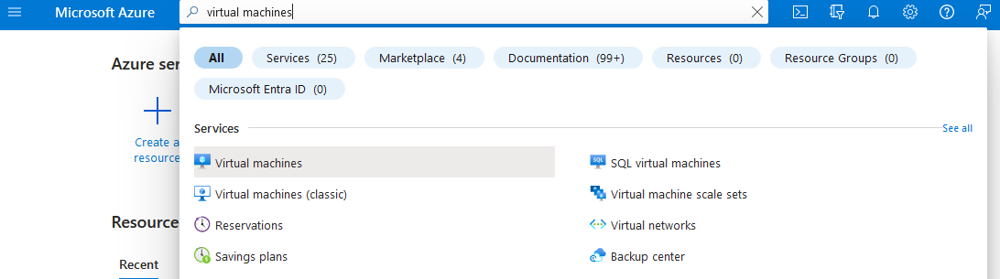
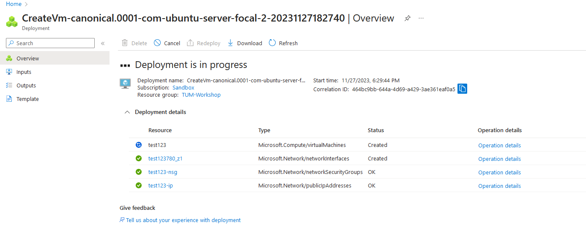
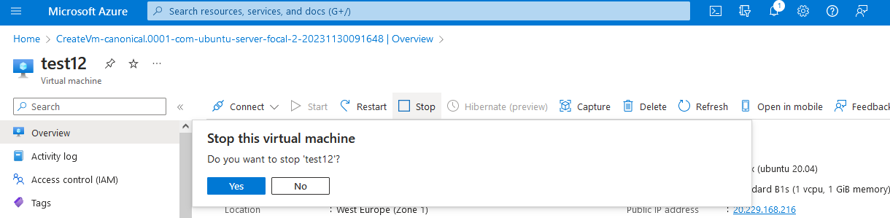
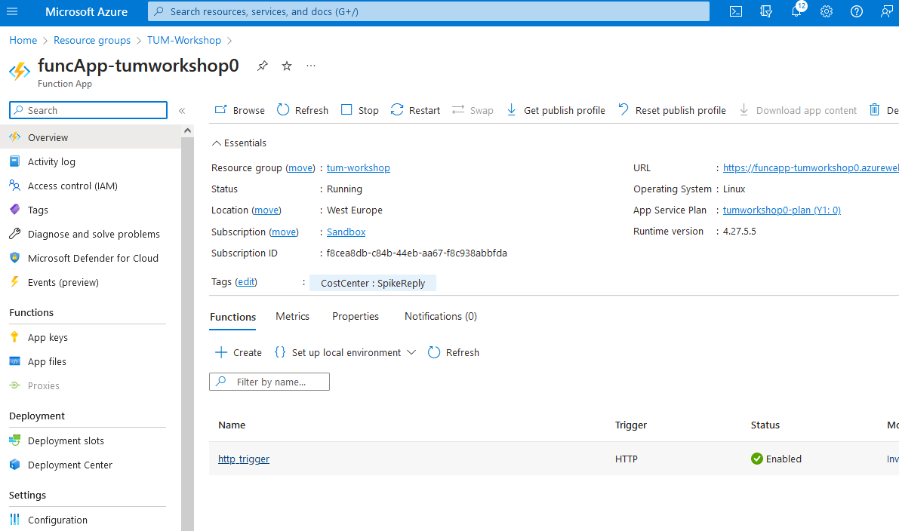

# Introduction

In this workshop you will gain hands on experience with the cloud.
The cloud lets us build traditional IT architectures (Virtual Machines, Databases, Networks) more easily and faster than in an on-premise environment. \
Additionally the cloud offers us possibilities to build new types of architectures, e.g. serverless functions. 
A serverless function is a piece of code that does not require us to create an underlying virtual machine or container to run. 
Therefore, we can focus on developing the actual function code instead of worrying about the server infrastructure.

This session consists of two parts:
* In the first part, we will provision a virtual machine from the Azure portal.
* In the second part, we deploy an Azure function app using [Terraform](https://terraform.io) to build a simple cloud native application.

# Part 1

The first contact point with the cloud is done by visiting the [Azure portal](https://portal.azure.com) with your web browser.

We will provide you with login credentials.

After you have successfully logged in to the Azure portal feel free to browse around.

## Provision a Virtual Machine

To provision a VM in Azure, simply search for **Virtual machines** in the searchbar.



Next, press the **Create** Button on the top left and chose **Azure virtual machine**

You are presented with a long list of options to customize your virtual machine. We will go with a simple small Linux machine.

Please set the following options:
* Resource group: **TUM-Workshop**
* Virtual machine name: *choose any unique name*
* Size: **B1s** -> press **See all sizes** and choose from the list. Please do not provision an expensive VM :)
* Leave all other options on default value

Now click **Review + create** at the bottom. (Ignore Deployment recommendations popup)

Take a few seconds to review your VM options.
When you are ready press **Create**.

Azure automatically creates a new key pair for you.
This key is used to SSH to your new VM. \
Press **Download private key and create resource**

Azure is now deploying your VM and creating additional resources necessary for your VM to work, such as network security, network interfaces and a public IP address.



After Deployment is finished press **Go to resource**. \
You now see an overview of your deployed VM resource with details on the network, disk, OS, etc.

Congratulations! You have successfully deployed your virtual machine in the public cloud!

## Connect to the Virtual Machine

Open your SSH client of choice and import the private key that you just downloaded.

In the Azure portal, go to your VM resource overview and press **Connect** at the top.

Select **Native SSH** and follow the instructions to connect to the VM with via its public IP address.

If you did everything correct, you will be greeted by this login shell page:

```
Welcome to Ubuntu 20.04.6 LTS (GNU/Linux 5.15.0-1050-azure x86_64)

 * Documentation:  https://help.ubuntu.com
 * Management:     https://landscape.canonical.com
 * Support:        https://ubuntu.com/advantage

  System information as of Mon Nov 27 17:39:57 UTC 2023

  System load:  0.08              Processes:             115
  Usage of /:   5.2% of 28.89GB   Users logged in:       0
  Memory usage: 7%                IPv4 address for eth0: 10.1.0.4
  Swap usage:   0%


Expanded Security Maintenance for Applications is not enabled.

0 updates can be applied immediately.

Enable ESM Apps to receive additional future security updates.
See https://ubuntu.com/esm or run: sudo pro status

The list of available updates is more than a week old.
To check for new updates run: sudo apt update


The programs included with the Ubuntu system are free software;
the exact distribution terms for each program are described in the
individual files in /usr/share/doc/*/copyright.

Ubuntu comes with ABSOLUTELY NO WARRANTY, to the extent permitted by
applicable law.

/usr/bin/xauth:  file /home/azureuser/.Xauthority does not exist
To run a command as administrator (user "root"), use "sudo <command>".
See "man sudo_root" for details.

azureuser@tum-workshop-vm:~$
```

Congratz! You are now connected to your VM and could start deploying your favourite application to it. 

For now, just logging into your VM is all we do today.

## Resize VM

Quickly changing the size of your deployed resources is one of the great advantages of the cloud.

Please now stop your VM in the Azure portal by clicking the **Stop** button at the top of your VM resource overview.



While your VM is stopping, locate the **Size** Setting on the left panel.

Here, you can adjust the vCPUs, RAM etc. of you VM.

Resize your VM to **B1ls**, which uses 1 vCPU and 0.5 GiB of RAM.

Resizing may take a 1-2 minutes.

Go back to the **Overview** tab of your VM and check the new Size **Standard B1ls (1 vcpu, 0.5 GiB memory)**

## Delete VM

Finally, we want to delete our VMs to clean up the resources.

Select your VM and click **Delete** on the top left.

Additionally, select the *Network interfaces* and *Public IP addresses* checkboxes to delete with your VM.

Press **Delete** at the bottom.


## Conclusion

In part 1 of this workshop, you got a first practical feel for the public cloud.\
You provisioned your own virtual machine and connected to it via SSH. \
You resized your VM to remove some RAM from it and save costs.
Finally you deleted your VM.

The Azure portal offers a great way to quickly create resources and get an overview of your deployed architecture. Feel free to continue exploring the portal throughout the remaining workshop.

The Azure portal is a great way to keep track of your resources that you will deploy in Part 2.

 # Part 2

In a real production environment, you will rarely **create** resources via the Azure portal. 
This is due to the fact that manually clicking in a WebUI is prone to errors and inconsistency.

Instead, we use Infrastructure as Code (IaC) to provision our resources.
One of the main players on the market for IaC is [Terraform](https://terraform.io).

You do not need to fully understand the ```terraform/*.tf``` files in this repository, but please take a few minutes to browse the files and have a look at their content. \
Notice that ```terraform/function.tf``` define so called ```resources```.
Each resource represents a single component (e.g. a virtual machine) of our cloud architecture.

To deploy these resources to the cloud, we use a simple Github Actions pipeline defined in ```.github/workflows/tf-apply.yml```.

The main component of our defined architecture is an **Azure function App**, which is a serverless function that executes simple python code in the cloud and can be triggered via HTTP request.

Your task is to deploy the infrastructure and add a new method to your **Azure function app**

## Deploying the cloud Resources

In Github, go to **Actions** on the top panel.

You will be presented 2 workflows which are defined via ```.github/workflows/tf-apply.yml``` as previously mentioned.

Click on **Manual Terraform Deploy on Azure**.

On the right, click the dropdown **Run workflow**.

Notice that you could run your Pipeline on any branch in the repository. This is usefull for testing purposes in a production environment before merging a pull request to main.

However, for now we leave the default main branch and press **Run workflow**.

A new pipeline execution appears. Lets click on it and have a look.

We can see two seperate Pipeline Jobs *Terraform Apply* and *Deploy Azure Function*. \
The first one creates all the Azure resources necessary to run our Azure Function App. The second job deploys the actual python code defined in ```src/``` to the Azure Function App.

Deploying the resources will take a few minutes.
In the meantime, feel free to go to the Azure portal and browse the different resources that are created in the Resource Group **TUM-Workshop**.

## Using your Azure Function App

To use your Azure Function App, search **Function App** in the Azure portal.

You will see a list of all Function Apps that you have access to which includes your own, but also the ones from your fellow students.

Select your own Function App (called e.g. *funcApp-tumworkshopapple*)



In the **Functions** tab you can see a list of all currently published functions. Right now there is only one function called *http_trigger*.

Click on **http_trigger**.

Now, at the top click on **Get Function Url** and copy the Url to your clipboard.

Paste the Url in your browser or your favourite API tool (e.g. curl or postman).

The function answers your HTTP request with a specific text.

Now, have a look again at the python code and try to get a different text by changing your HTTP request.

<details>
    <summary><strong>Hint</strong></summary>

How can a HTTP request be customized?
Headers, Query parameters, Body?

<details>
    <summary><strong>Another Hint</strong></summary>
      
set a specific query parameter!

<details>
    <summary><strong>Give me the solution!</strong></summary>
      
https://***your-function-name***.azurewebsites.net/api/http-trigger?name=John

</details>

</details>

</details>

## Add a new function

The current function is published at ```https://your-function-name.azurewebsites.net/api/http-trigger```

We want to add a new function to the code to offer a new method on a different path (maybe now ```/sum```).

Create a new function that offers a simple sum of two integers ```a``` and ```b```.

Adjust the python code, push to your repository and redeploy your new code via Github actions pipeline as previously.

<details>
    <summary><strong>I am too lazy to write the code myself.</strong></summary>

Too bad! I won't help you here.

<details>
    <summary><strong>ok ok, maybe just the header?</strong></summary>

```
@app.route(route="sum")
def sum(req: func.HttpRequest) -> func.HttpResponse:
    ...
```

<details>
    <summary><strong>I am still lost. Give me the complete function.</strong></summary>

```
@app.route(route="sum")
def sum(req: func.HttpRequest) -> func.HttpResponse:

    a = req.params.get('a')
    b = req.params.get('b')

    try:
        a = int(a)
        b = int(b)
    except ValueError:
        return func.HttpResponse(
            f'The values of "a" and "b" are not Integers :(', 
            status_code=400
        )

    if a and b:
        sum_a_b = int(a) + int(b)
        return func.HttpResponse(f"The sum of {a} and {b} is {sum_a_b}")
    else:
        return func.HttpResponse(
             'Please provide two Integers as query parameters for "a" and "b"',
             status_code=200
        )
```

</details>

</details>

</details>

\
After your new function has been deployed, please test it out and enjoy your new online calculator :D

## Conclusion

Congratulations! You finished the second part of the hands-on workshop!

You got a first glimps of the magic world of Infrastructure-as-code and developed your first own serverless function.
Finally you deployed it to the cloud in a true DevOps approach via an automated Github Actions pipeline.

### You reached the end of our workshop for today! Feel free to help your fellow students or continue browsing the Azure portal to discover the wide range of cloud native services :)